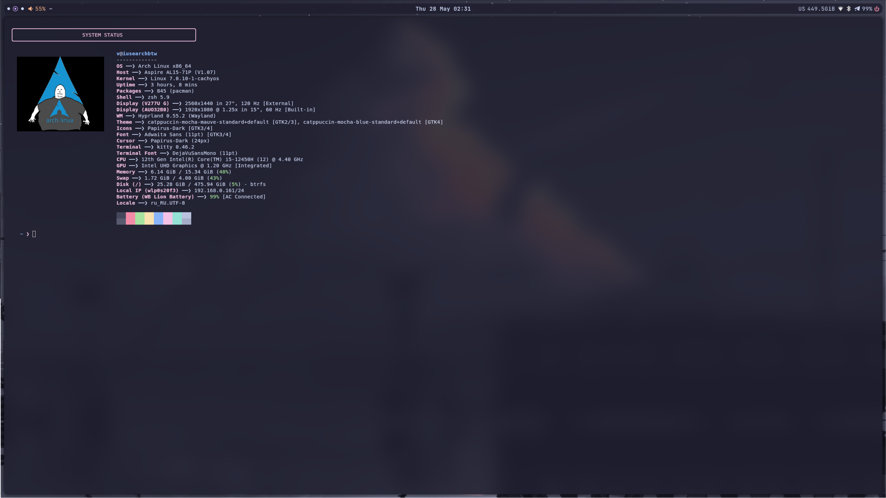
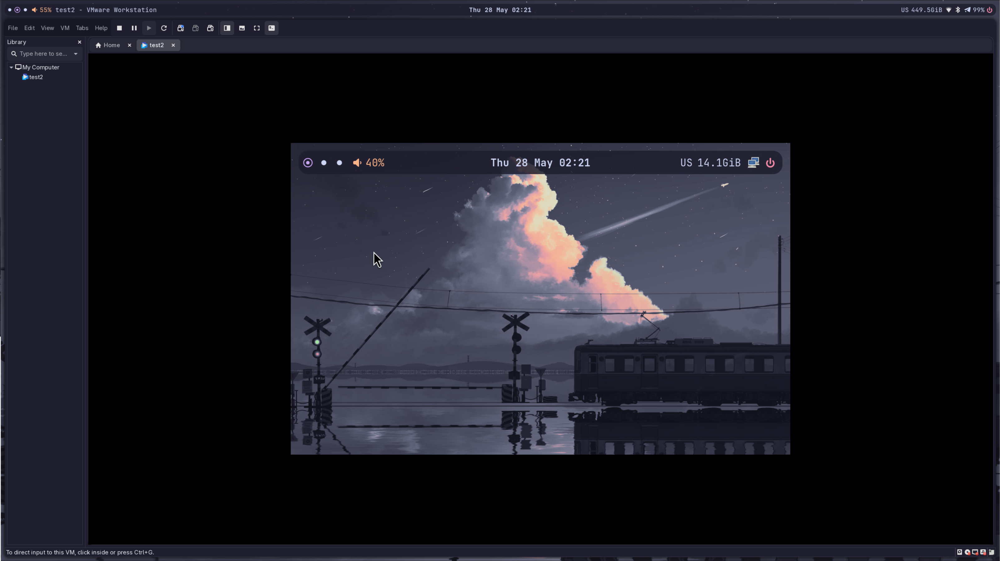

# My rice ──❯ YOUR RICE!

============
Hi. These are my dotfiles for Arch Linux, as I'm incredibly lazy and too lazy to set it all up again. If you like them, feel free to use them!


## Screenshots


| Real Hardware (Host) | Virtual Machine (VMware/VirtualBox) |
|---|---|
|  |  |


## For the lazy (Quick Start):

```bash
git clone https://github.com/ViYaR-888/ru_dot_for_arch_linux.git
cd ru_dot_for_arch_linux
./install.sh
```

That's it. The script will automatically install and configure everything for you.

##  What's inside:
* **WM:** Hyprland (Smooth & Fast)
* **Status Bar:** Waybar (Catppuccin Mocha)
* **Terminal:** Kitty + Zsh (with Fish-like autosuggestions)
* **Display Manager:** SDDM (Pixel Dusk City theme)
* **Application Launcher:** Rofi
* **Notifications:** Dunst


## Testing on a Virtual Machine? Read this!

If you are trying out this rice inside a VM (like VMware or VirtualBox), you will probably run into two annoying issues: a crashing terminal and keys not working. Here is how to fix them in 2 minutes:

### 1. Terminal instantly closes? (Kitty ──> Foot)
`kitty` uses your GPU for hardware acceleration. VM graphics drivers hate this, so Kitty will just crash on startup. 
* **The Fix:** Switch to `foot`, a super lightweight terminal that doesn't care about GPU acceleration.
* Open `~/.config/hypr/hyprland.conf` and change the terminal variable to:

  ```ini
  $terminal = foot
  ```

### 2. Can't open the terminal? (Host Key Conflict)
Your main OS (the host) loves to steal the **`Super` (Win)** key. Because of this, combos like `Super + Q` won't reach the VM.
* **The Fix:** Tell your VM to lock your mouse and keyboard fully. In VMware, just click inside the window or press `Ctrl + G`. In VirtualBox, use your `Host Key` (Right Ctrl) to capture input.
* If it still doesn't work, just temporarily change the bind inside `hyprland.conf` to something like:
  
  ```ini
  bind = $mainMod, Q, exec, $terminal
  ```


## Troubleshooting: Missing Wi-Fi or Bluetooth icons?

If your top bar looks clean but the system tray on the right is completely empty, don't panic! The fonts are fine. The apps are just sleeping. 

Since this is a fresh Arch install, you need to manually enable and autostart the network and bluetooth background services:

1. **Wake up the system services** (run this in your terminal):
   
   ```bash
   sudo systemctl enable --now NetworkManager
   sudo systemctl enable --now bluetooth
   ```

2. **Add them to Hyprland's autostart**:
   Open `~/.config/hypr/hyprland.conf` and add these two lines at the bottom so they launch every time you log in:
   
   ```ini
   exec-once = nm-applet --now
   exec-once = blueman-applet
   ```

Reboot your system, and the neat little tray icons will pop right up!


> **And remember ── it's Linux, you can do anything here!** 


============
#btwiusearch
